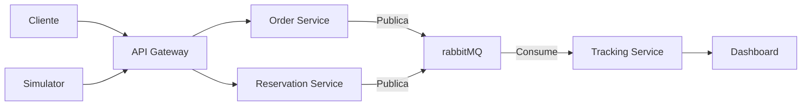

# 🍽️ GourmetHub - Sistema de Gestión de Restaurante en Tiempo Real

**GourmetHub** es un sistema de gestión de restaurante basado en microservicios
que procesa órdenes y reservaciones en tiempo real usando RabbitMQ. Diseñado
para alta escalabilidad y seguimiento de métricas de desempeño.

<!-- El api gateway implementa un reverse proxy, -->
